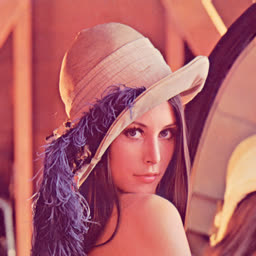
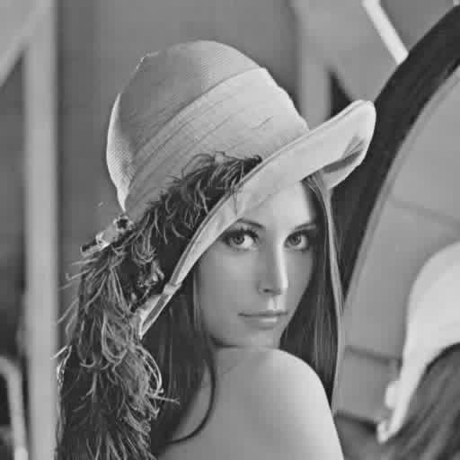
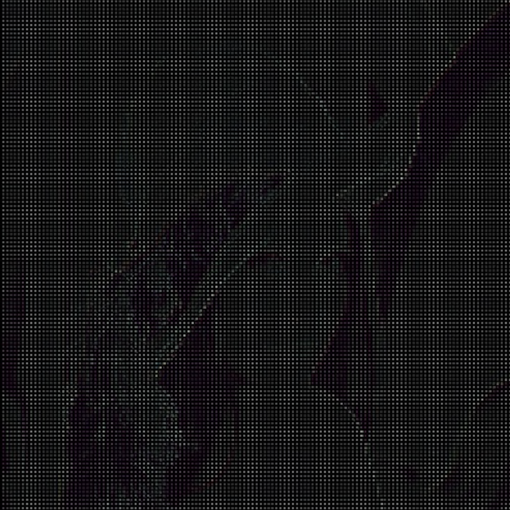
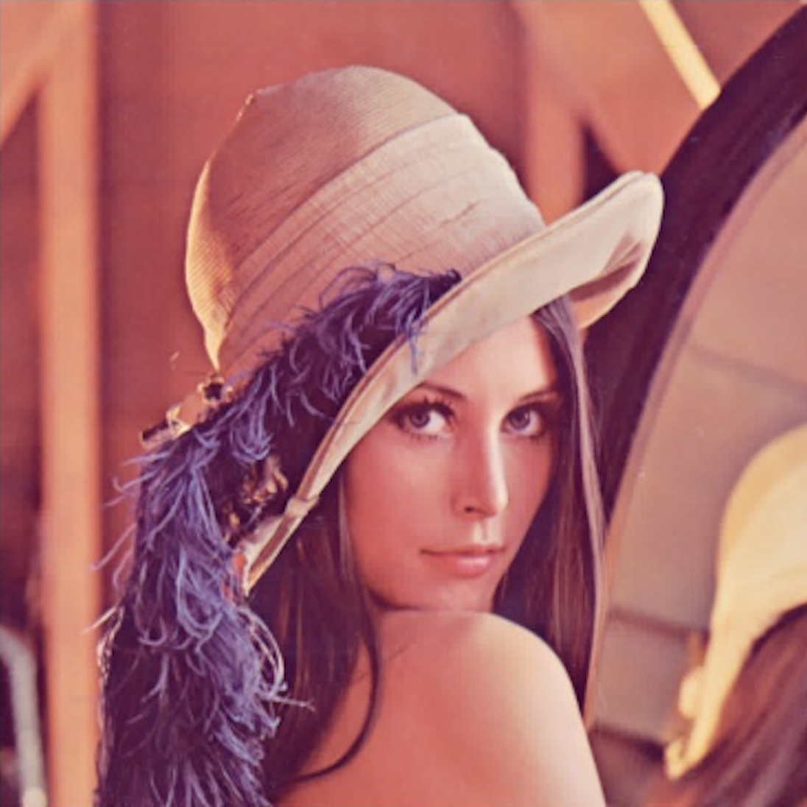
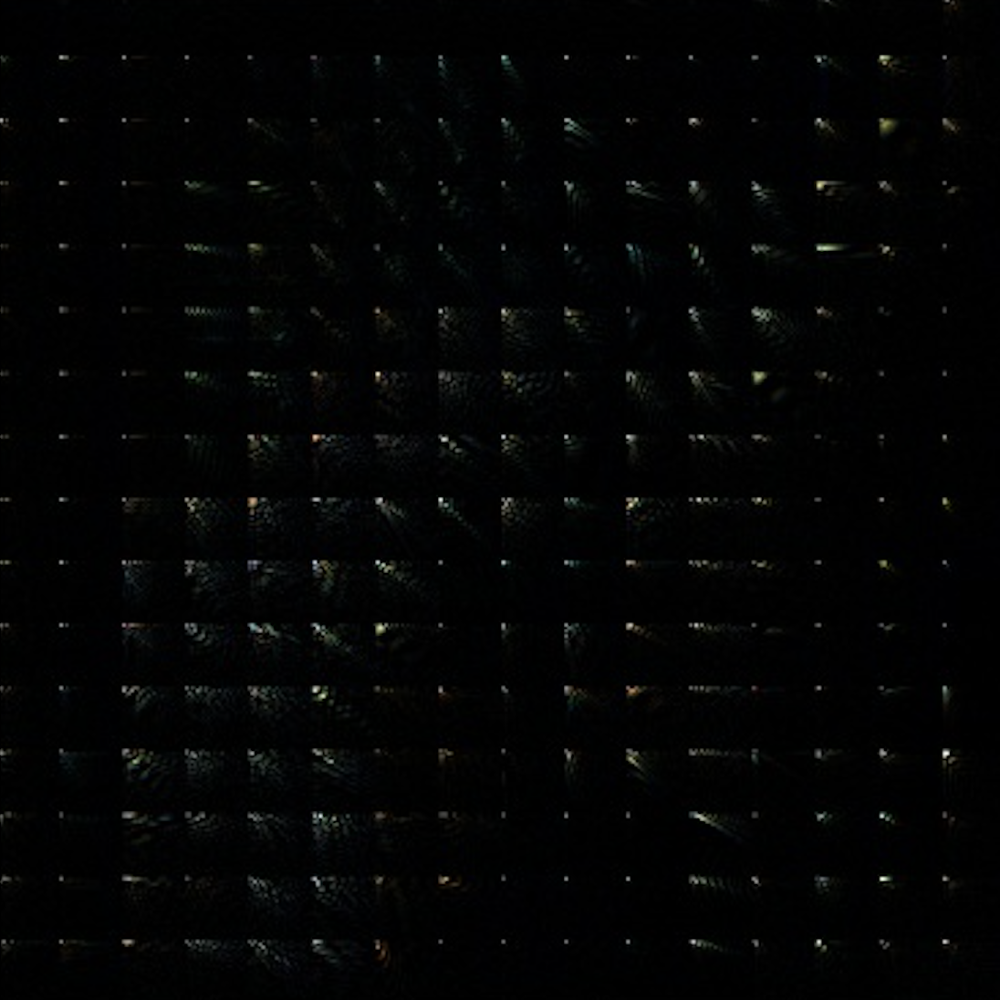
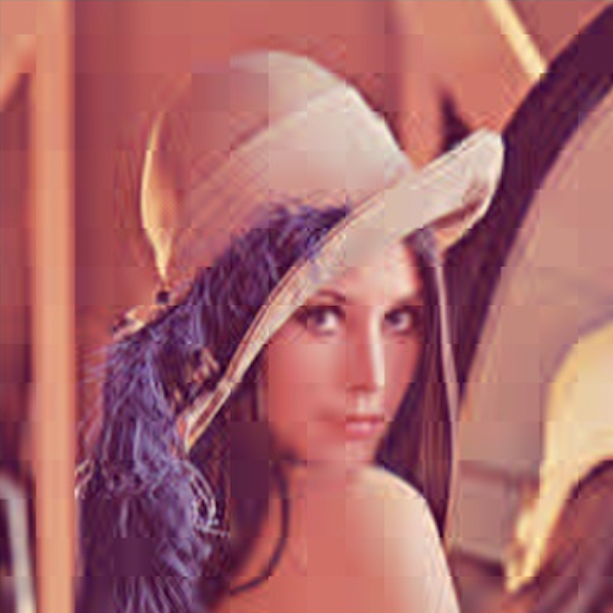

# Lab1 - JPEG

**1. RGB to YUV and YUV to RGB**

RGB to YUV

```python
Y  =   0.257 * R + 0.504 * G + 0.098 * B + 16
Cb = - 0.148 * R - 0.291 * G + 0.439 * B + 128
Cr =   0.439 * R - 0.368 * G - 0.071 * B + 128

```
YUV to RGB

```python
R = 1.164 * (Y - 16) + 1.596 * (Cr - 128)
G = 1.164 * (Y - 16) - 0.813 * (Cr - 128) - 0.391 * (Cb - 128)
B = 1.164 * (Y - 16)                      + 2.018 * (Cb - 128)
```

<br/><br/>
**2. Using ffmpeg to resize images into lower quality**

With ffmpeg, we can resize an image by defining an scale, if we'd like to keep the aspect ratio, we can specify only one component, either width or height, and set the other component to -1. We can scale an image to 64x64 using the following command:

```
ffmpeg -i {input_file} -vf scale=64:-1 {output_file}
```
| 512x512 - 474KB | 256x256 - 16KB | 128x128 - 7KB | 64x64 - 3KB | 32x32 - 1KB |
| :---:        |     :---:      |      :---: |     :---:      |          :---: |
|    |     |     |     |     |

<br/><br/>
**3. Using FFMPEG to transform the Lenna image into b/w.**

To convert an image to gray scale we can use the following command:

```
ffmpeg -i {input_file} -vf format=gray {output_file}
```
And then to compress the image we can use:

```
ffmpeg -y -i {output_file_bw} -q:v 10 {output_file}
```

| 512x512 - 26KB | 512x512 - 14KB |
| :---:        |     :---:      |
|    |     | 


<br/><br/>
**4. Run-length encoding (RLE)**

RLE is a form of lossless data compression. The basic idea behind it is to encode information about runs of identical numbers rather than encode the numbers themselves.

Considering this sequence:

```
5 5 5 5 1 2 3 4 5 6 8 8 8 2 2 2 2 2
```
Applying RLE_1 the encoded string would be:
```
4 5 1 1 1 2 1 3 1 4 1 5 1 6 3 8 5 2
```
With RLE_2 we can encode strings of dissimilar numbers, the string could be expressed as:
```
4 5 -6 1 2 3 4 5 6 3 8 5 2
```

<br/><br/>
**5. Encode and decode an image using DCT**

Using blockwise DCT and IDCT we can encode and decode an image and obtain a compressed version of the original image. 

|  DCT Coefficients using bloks of size   4x4  |  Decoded image using using bloks of size   4x4  |
|     :---:     |     :---:     |
|    | | 
| **DCT Coefficients using bloks of size 32x32** | **Decoded image using using bloks of size 32x32** |
|    | | 
