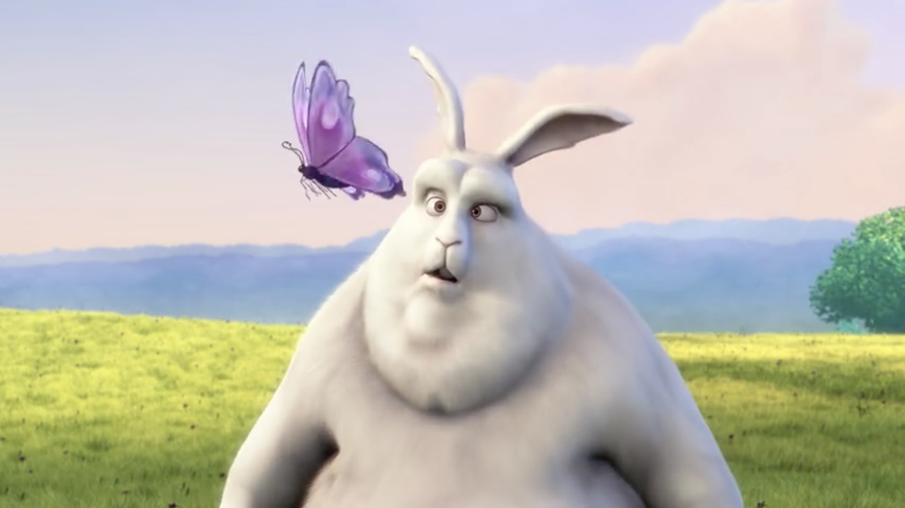
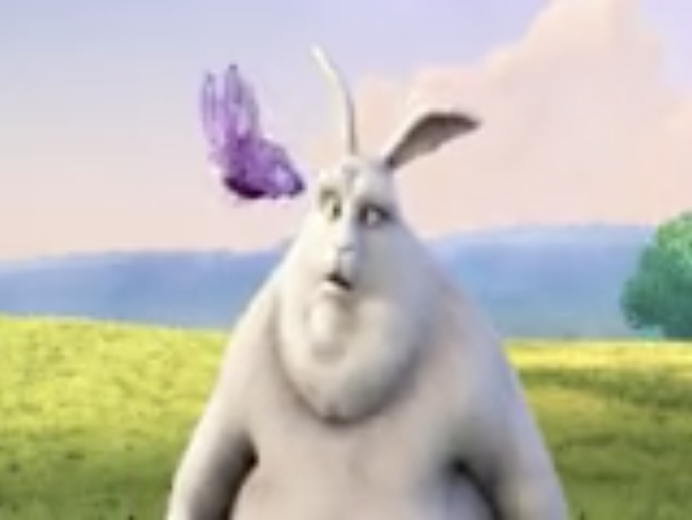

# Seminar2 - MPEG

**1. Cut 10 seconds of the BBB video**

To cut a video we can use the next command:

```
ffmpeg -ss 00:00:00 -i {input_file} -t 00:00:10 -c copy {output_file}
```

 `-ss` This is the time the trimmed video will start with

 `-t` This option specifies the duration of the new video

<br/><br/>
**2. Extract the YUV histogram from the previous BBB videos and create a new video with both images at the same time**

The next command creates a new video with the YUV histogram overlaid on top of the input video

```
ffmpeg -i {input_file} -vf split=2[a][b],[b]histogram,format=yuva444p[hh],[a][hh]overlay -c:a copy {output_file}
```


<br/><br/>
**3. Resize the BBB video**

If only the height is provided we can use `-2` and ffmpeg will automatically choose the correct width.

```
ffmpeg -i {input_file} -vf scale=-2:720 -c:a copy {output_file}
```

If we don't want to keep the aspect ratio we have to define the height and the width and use the `setsar=1` to filter the video.

```
ffmpeg -i {input_file} -vf scale=360x240,setsar=1 -c:a copy {output_file}
```

| 1920×1080 | 1280×720 | 853×480 | 360×240 | 160×120 |
| :---:  |    :---:   |   :---: |     :---:      |  :---: |
|    |     |      |     |    |

<br/><br/>
**4. Change the audio into mono output and in a different audio codec**

To change the audio into mono and the audio codec we can use the next command:
```
ffmpeg -i {input_file} -acodec {codec} -ac 1 {output_file}
```
