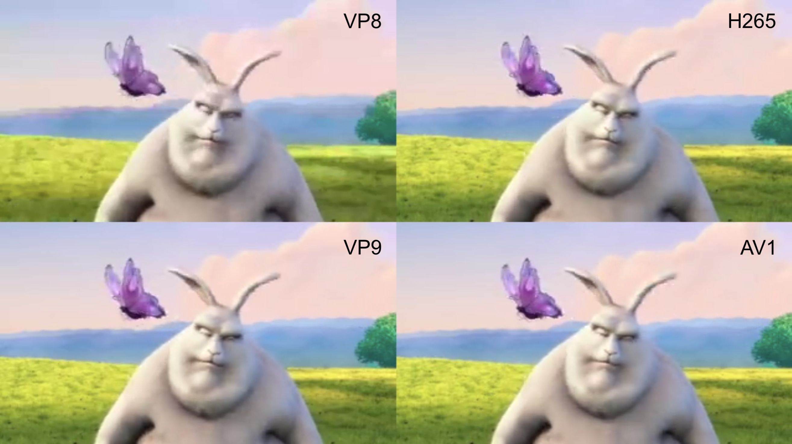
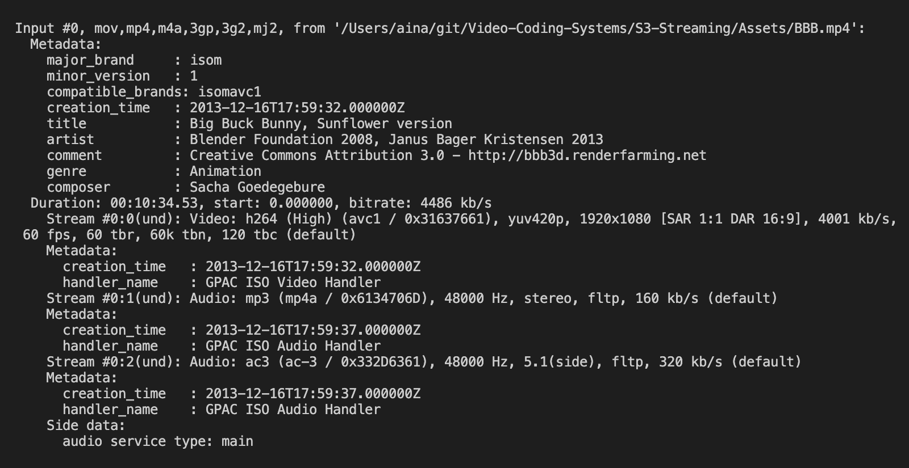
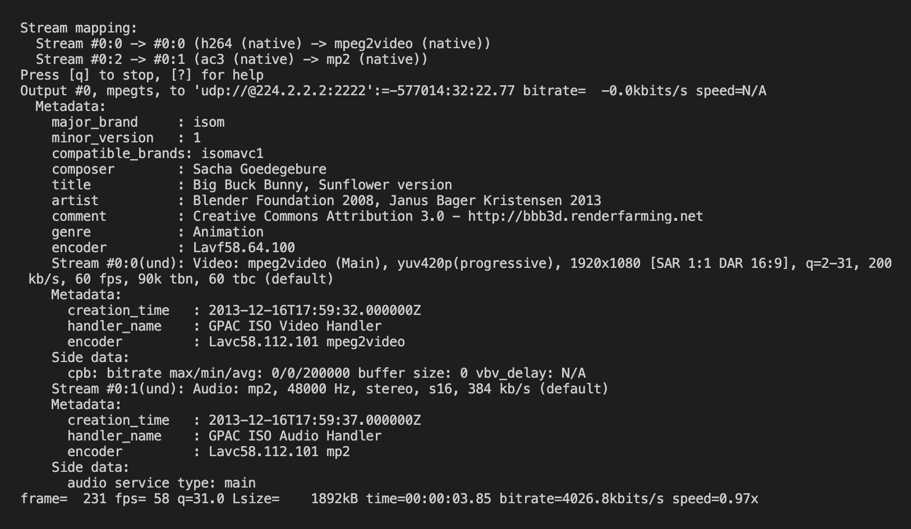

# Seminar3 - Streaming

<br/>

When executing the `script.py` file the following menu will appear:

```
[?] Choose an exercise:
 > 1) Mosaic
   2) Streaming
```
<br/>

**1. Mosaic**

When choosing the mosaic option this new menu will appear:
```
[?] Choose a size:
 > 720p
   480p
   360x240
   160x120
```

After choosing the size four new videos with the codecs VP8, VP9, h265 & AV1 will be created and stored in `Results/size`. Then a mosaic with the four videos will be displayed and stored too.

<p align="center">
  
</p>


We can see that the videos that have been created using the codecs VP8 and h265 have lower bitrate and thus lower quality than the ones that use the codecs VP9 and AV1.


<br/>

**2. Streaming**

To create a live streaming of the BBB Video the following command will be executed:
```
ffmpeg -re -i {input_file} -f mpegts udp://@224.2.2.2:2222
```

This will broadcast the video into the IP address: `udp://@224.2.2.2:2222`

<p align="center">
  
</p>

<p align="center">
  
</p>
